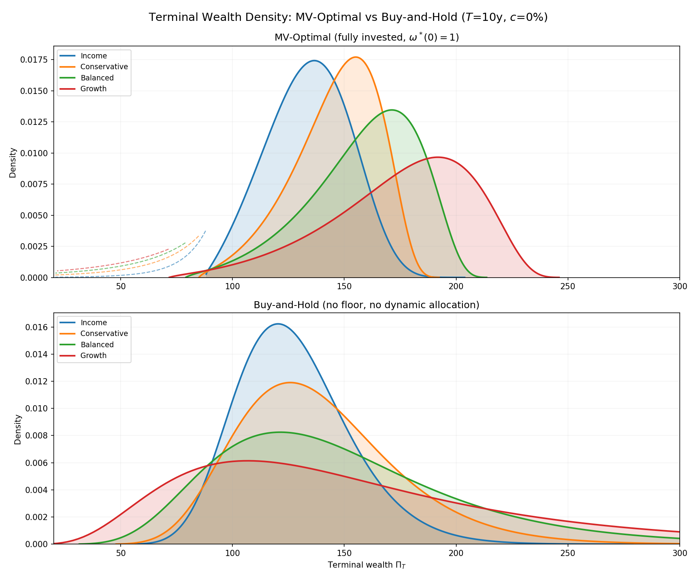
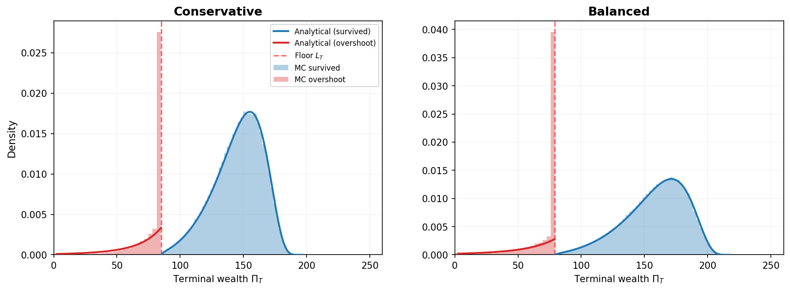
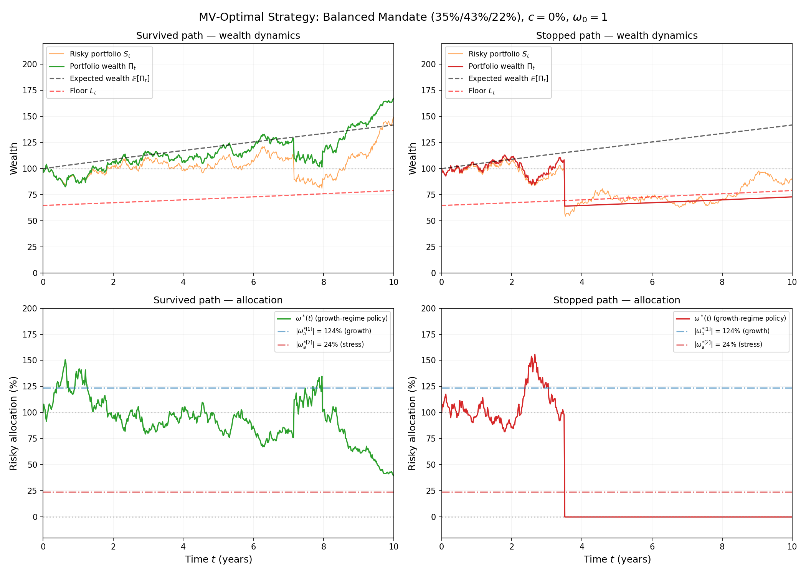
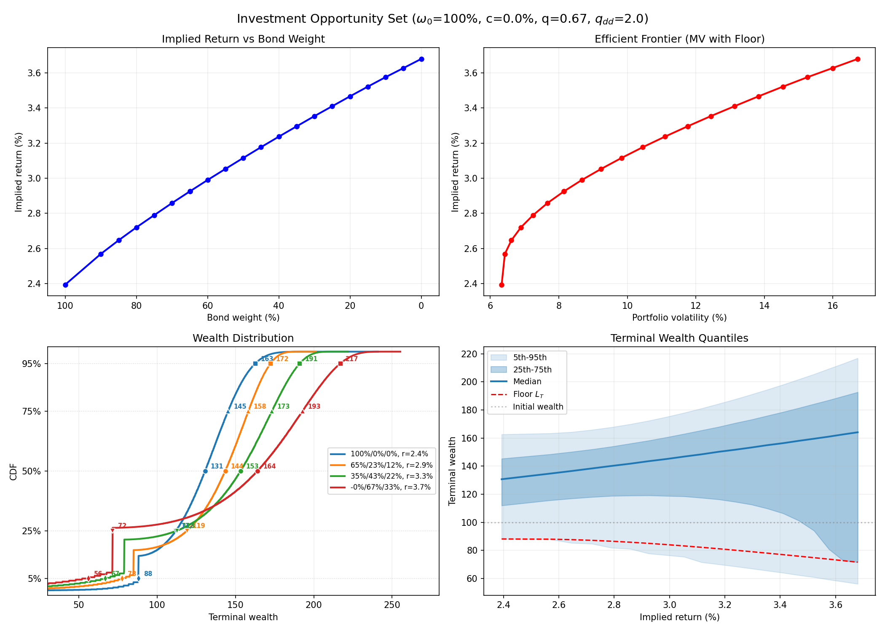

# GoalBasedAllocation (`goal-based-allocation`)

Analytical dynamic mean-variance allocation and terminal-wealth risk under
regime-switching jump-diffusions in Python for quantitative researchers and
wealth-management model developers.

[](https://pypi.org/project/goal-based-allocation/)
[](https://pypi.org/project/goal-based-allocation/)
[](LICENSE)
[](https://github.com/ArturSepp/GoalBasedAllocation/actions/workflows/tests.yml)
[](https://pepy.tech/project/goal-based-allocation)
[](https://pepy.tech/project/goal-based-allocation)

**Documentation:** [artursepp.github.io/GoalBasedAllocation](https://artursepp.github.io/GoalBasedAllocation/)

**Paper:** companion code to Sepp, A. (2026), *Dynamic Mean-Variance Portfolio Allocation under Regime-Switching Jump-Diffusions with Absorbing Barriers and Distribution Matching* — [SSRN 6534579](https://papers.ssrn.com/sol3/papers.cfm?abstract_id=6534579). See [Citation](#citation) for BibTeX.

---

## Overview

This package provides a **fully analytical Laplace-transform framework** for dynamic
mean-variance (MV) portfolio allocation under a two-state regime-switching model
with exponential jumps at regime transitions and an absorbing wealth floor.

It models two regimes and multi-asset mandates aggregated to one effective risky
asset. It is not a discrete constrained multi-asset optimiser, trading engine, or
production portfolio-management system; use
[`optimalportfolios`](https://github.com/ArturSepp/OptimalPortfolios) for rolling
multi-asset construction, constraints, transaction costs, and backtesting.

The MV-optimal strategy takes the form

$$\omega^{\ast}(t) = |\omega^{\ast}_a| \cdot \left(\frac{\Pi^{\ast}(t)}{\Pi_t} - 1\right)$$

where $\Pi^{\ast}(t)$ is the target wealth trajectory derived from the Riccati ODE system,
and $|\omega^{\ast}_a|$ is the regime-dependent allocation intensity. This produces an
**endogenous de-risking glide path**: early in the horizon the funding gap is large
and allocation is aggressive; as the portfolio approaches the target, allocation
moderates automatically.

The terminal wealth density has three analytically tractable components:

1. **Survived density** — wealth above the floor at horizon, computed via
   Laplace inversion of the bounded transition density
2. **Floor atom** — probability mass from diffusion paths hitting the absorbing barrier
3. **Jump-overshoot density** — wealth below the floor from crash jumps that gap
   through the barrier, computed via the overshoot distribution

All three components are computed semi-analytically using the Abate-Whitt (1995)
Euler acceleration method for numerical Laplace inversion. No Monte Carlo
simulation is needed for pricing; MC is used only for validation.

### Key features

- Analytical survival probability, conditional moments, and tilted survival via Laplace transforms
- Riccati ODE system for the MV-optimal policy with regime-dependent coefficients
- Full terminal wealth density decomposition (survived + floor atom + overshoot)
- Exact buy-and-hold moments under regime-switching via 2×2 matrix exponential
- Portfolio mandate construction with deterministic quadrature for jump aggregation
- Expected allocation glide paths with variance bands
- Investment opportunity set construction for client-facing portfolio advice
- Vanilla option pricing under the same regime-switching jump-diffusion via one Laplace inversion (calls/puts, both regimes, joint strikes)
- Monte Carlo simulator for validation of all analytical results
- Integration tests and all paper figures reproducible from a single command

## When to use it — and when not

Use `goal-based-allocation` to design goal-based mandates under regime switching: survival and shortfall probabilities against a wealth floor, MV-optimal allocation intensities and glide paths, terminal wealth distributions, investment opportunity sets for client advice, and regime-switching vanilla option pricing on the same Laplace engine — all analytically, with Monte Carlo reserved for validation.

The model is deliberately parsimonious: two regimes, exponential jumps at transitions, and multi-asset mandates reduced to a single effective asset via portfolio aggregation. For discrete rolling multi-asset optimisation with weight constraints and transaction costs, use [`optimalportfolios`](https://github.com/ArturSepp/OptimalPortfolios).

## Model

The portfolio wealth $\Pi_t$ follows a regime-switching jump-diffusion
with two states: **growth** ($i=1$) and **stress** ($i=2$).

### Notation (paper → code)

| Symbol | Name | Code variable |
|---|---|---|
| $\bar{\mu}^{[i]}$ | Total expected return (CMA observable) | `mu_growth`, `mu_stress` |
| $\mu^{[i]} = \bar{\mu}^{[i]} - \lambda \alpha^{[i]}$ | Diffusion drift | `mu_bar` |
| $r_h = \max(r, c)$ | Hurdle rate | `r_h` |
| $r_c = r_h - c = \max(0, r-c)$ | Net floor growth rate | `r_c` |
| $\omega^{\ast}_a = -\tilde{a}^{[i]}/\Sigma^{[i]}$ | Risky allocation coefficient | `w_a` |

### Process specification

| Component | Description |
|---|---|
| Diffusion | Regime-dependent drift $\mu^{[i]}$ and volatility $\sigma^{[i]}$ |
| Jumps | Exponential crash at growth→stress ($\eta^{[1]}$), exponential recovery at stress→growth ($\eta^{[2]}$) |
| Regime switching | Poisson rates $\lambda^{[12]}$ (crash) and $\lambda^{[21]}$ (recovery) |
| MV-optimal control | $\omega^{\ast}(t) = \|\omega_a^{\ast}\| \cdot (\Pi^{\ast}(t)/\Pi_t - 1)$, from Riccati system |
| Absorbing floor | Wealth stopped at $L_t = L_0 \cdot e^{r_c t}$, converting to cash |

### Asset class parameters

| | Bonds | Equity | Private Equity |
|---|---|---|---|
| $\bar{\mu}^{[1]}$ / $\bar{\mu}^{[2]}$ | 2.5% / 2.0% | 4.5% / 0.0% | 7.0% / 0.0% |
| $\sigma^{[1]}$ / $\sigma^{[2]}$ | 6% / 9% | 15% / 22.5% | 20% / 30% |
| Crash loss / Recovery gain | 8% / 5% | 25% / 15% | 30% / 20% |

Shared: $\lambda^{[12]} = 0.1$, $\lambda^{[21]} = 1.0$, $r = 2\%$, $T = 10$y, $\Pi_0 = 100$.

### Mandate specification

Mandates are defined by bond weight $w$ with equity-PE split $g = 2/3$:
$w_{\text{eq}} = g(1-w)$, $w_{\text{pe}} = (1-g)(1-w)$.

| Mandate | Weights (Bd/Eq/PE) | $\sigma_g$ / $\sigma_s$ | $\bar{\mu}_g$ / $\bar{\mu}_s$ | $\eta^{[1]}$ |
|---|---|---|---|---|
| Income | 100/0/0 | 6.0 / 9.0% | 2.50 / 2.00% | 0.087 |
| Conservative | 65/23/12 | 7.7 / 11.6% | 3.49 / 1.30% | 0.161 |
| Balanced | 35/43/22 | 11.1 / 16.7% | 4.34 / 0.70% | 0.233 |
| Growth | 0/67/33 | 15.8 / 23.8% | 5.33 / 0.00% | 0.334 |

### MV-optimal results ($c=0\%$, $\omega^{\ast}(0)=1$, $q_{dd}=2$)

| Mandate | $r_{\text{impl}}$ | $\Pi^{\ast}_T$ | $\mathbb{E}[\Pi_T]$ | Std | Survival | $r^{\text{BH}}_{\text{impl}}$ | $\text{Std}^{\text{BH}}$ |
|---|---|---|---|---|---|---|---|
| Income | 2.39% | 240 | 127 | 24.7 | 85.5% | 2.46% | 30.4 |
| Conservative | 2.92% | 200 | 134 | 33.7 | 83.2% | 3.33% | 48.3 |
| Balanced | 3.30% | 221 | 139 | 46.1 | 78.7% | 4.10% | 74.8 |
| Growth | 3.68% | 254 | 144 | 61.9 | 73.8% | 5.01% | 117.6 |

Floor protection cost ranges from 6bp (income) to 117bp (growth). BH moments
are exact under the RS-JD model via 2×2 matrix exponential (Proposition B.7).

## Installation

```bash
# From PyPI
pip install goal-based-allocation

# Or directly from GitHub
pip install git+https://github.com/ArturSepp/GoalBasedAllocation.git

# Or clone and install in development mode
git clone https://github.com/ArturSepp/GoalBasedAllocation.git
cd GoalBasedAllocation
pip install -e .
```

Requires Python >= 3.10 with NumPy >= 1.24, SciPy >= 1.10, and Matplotlib >= 3.7.

## Package Structure

```
GoalBasedAllocation/
├── src/
│   └── goal_based_allocation/      # Core library
│       ├── regime_switch_paper.py  # Density, survival, overshoot, BH moments
│       ├── riccati_solver.py       # Riccati ODE system + MC simulator
│       ├── laplace_inversion.py    # Abate-Whitt & Stehfest numerical inversion
│       ├── client_solver.py        # Effective asset construction, portfolio eta quadrature
│       ├── mandate_utils.py        # Portfolio mandate construction from assets
│       ├── opportunity_set.py      # Investment opportunity set & advisor framework
│       ├── vanilla_option_pricer.py # Regime-switching vanilla option pricing
│       └── run/                     # Source-only development runners (*_local.py)
├── examples/                       # Minimal, self-contained illustrations
│   ├── wealth_process_simulation.py
│   ├── terminal_wealth_distribution.py
│   ├── investment_opportunity_set.py
│   └── regime_switch_smile.py      # Vol smile + Fourier/MC reference pricers
├── papers/
│   └── goal_based_allocation_2026/ # Self-contained paper: LaTeX, PDF, figures
│       ├── goal_based_allocation_2026.tex
│       ├── generate_paper_figures.py   # All 10 figures + integration tests
│       └── figures/
├── pyproject.toml
├── LICENSE
└── README.md
```

### Module reference

| Module | Description | Key functions |
|---|---|---|
| `regime_switch_paper` | Core Laplace framework for the RS-JD gap process | `compute_density`, `compute_survival`, `compute_tilted_survival`, `compute_overshoot_density`, `bh_moments_rsjd` |
| `riccati_solver` | Riccati ODE for MV-optimal policy, gap process, MC validation | `find_ell`, `gap_process_asset`, `simulate_mv_optimal` |
| `laplace_inversion` | Numerical Laplace inversion algorithms | `laplace_invert_abate_whitt`, `laplace_invert_stehfest` |
| `client_solver` | Effective single-asset from multi-asset portfolios | `build_effective_asset`, `portfolio_sigma_unc`, `portfolio_eta_quadrature` |
| `mandate_utils` | Named mandates (Income, Conservative, Balanced, Growth) | `mandate_effective_asset` |
| `opportunity_set` | Two-step advisor framework: opportunity set + client profile | `AdvisorSpec`, `compute_opportunity_point`, `build_opportunity_set` |
| `vanilla_option_pricer` | Laplace-transform vanilla option pricing under regime switching | `RiskNeutralParams`, `price_vanilla`, `implied_vol` |

Component development checks live under `src/goal_based_allocation/run/` as
`<subject>_local.py`. Each runner exposes `Locals` and `run_local(local=...)`; these files are
excluded from built distributions. Automated checks remain in the top-level `tests/` directory.

## Quick Start

### 1. Compute survival probability for a single asset

```python
from goal_based_allocation import create_paper_assets, compute_survival

assets = create_paper_assets()
eq = assets['equity']

for T in [1, 2, 5, 10]:
    S = compute_survival(T, eq.x0, eq)
    print(f"T={T:2d}y: survival={S:.4f}, stopping={1-S:.4f}")
```

### 2. Solve the MV-optimal allocation and compute the terminal wealth density

```python
import numpy as np
from goal_based_allocation import (
    create_paper_assets, compute_density, compute_survival,
    compute_overshoot_density
)
from goal_based_allocation.riccati_solver import find_ell, gap_process_asset

assets = create_paper_assets()
eq = assets['equity']
T = 10.0

# Solve Riccati ODE for target return of 4%
ell, ric = find_ell(eq, T, target_return=0.04, r=0.02, c=0.02)
gap = gap_process_asset(ric)

# Terminal targets
PiT = ric.derived_at_tau(0)['Pi_star'][0]   # target wealth at T
L_T = eq.pi_floor                            # floor at T (with r=c)
B_T = PiT - L_T                              # buffer

# Bounded gap density -> wealth density
x_grid = np.linspace(0.001, 4.0, 800)
d0, d1 = compute_density(T, x_grid, gap)
density_total = d0 + d1

# Survival and overshoot
S = compute_survival(T, gap.x0, gap)
d_ov = np.linspace(0.001, 8.0, 400)
f_ov = compute_overshoot_density(T, d_ov, gap)

print(f"target wealth = {PiT:.1f}, floor = {L_T:.1f}")
print(f"Survival = {S:.4f}")
print(f"Overshoot mass = {np.trapezoid(f_ov, d_ov):.4f}")
print(f"Floor atom = {1 - S - np.trapezoid(f_ov, d_ov):.4f}")
```

### 3. Compare MV-optimal vs buy-and-hold

```python
from goal_based_allocation import (
    build_effective_asset, bh_moments_rsjd, compute_survival
)
from goal_based_allocation.riccati_solver import find_ell, gap_process_asset

# Build balanced mandate (35% bonds, 43% equity, 22% PE)
eff = build_effective_asset(w_eq=0.43, w_pe=0.22, k=3.0)
T, PI0 = 10.0, 100.0

# MV-optimal survival (analytical via Laplace)
ell, ric = find_ell(eff, T, target_return=0.04, r=0.02, c=0.0)
gap = gap_process_asset(ric)
S = compute_survival(T, gap.x0, gap)
print(f"MV survival: {S:.3f}")

# BH moments (exact via matrix exponential)
bh = bh_moments_rsjd(T, PI0, eff, c=0.0)
print(f"BH: E={bh['E']:.0f}, Std={bh['Std']:.1f}, r_impl={bh['r_impl']*100:.2f}%")
```

### 4. Build an investment opportunity set

```python
from goal_based_allocation import AdvisorSpec, build_opportunity_set

spec = AdvisorSpec(omega_0=1.0, c=0.0, q=2/3, q_dd=2.0)
opp = build_opportunity_set(spec)

for p in opp:
    print(f"Bonds={p['w_bd']:4.0%}  r_impl={p['r_impl']:5.2%}  "
          f"Surv={p['S']:5.1%}  Median={p['q50']:6.0f}")
```

### 5. Price a vanilla option under regime switching

```python
import numpy as np
from goal_based_allocation import RiskNeutralParams, price_vanilla, implied_vol, Regime

# risk-neutral parameters (rate convention: eta_rate = 1 / eta_mean)
params = RiskNeutralParams.from_rates(sigma_0=0.18, sigma_1=0.28,
                                      lambda_01=0.10, lambda_10=1.0,
                                      eta_01=3.0, eta_10=8.0, rate=0.03)

strikes = np.array([80.0, 100.0, 120.0, 150.0, 200.0])
calls = price_vanilla(params, spot=100.0, strikes=strikes, ttm=10.0,
                      regime=Regime.GROWTH, option_type='call')
vols = implied_vol(params, spot=100.0, strikes=strikes, ttm=10.0, regime=Regime.GROWTH)

for k, c, v in zip(strikes, calls, vols):
    print(f"K={k:5.0f}  call={c:8.4f}  implied_vol={v:6.2%}")
```

Prices come from a single Laplace inversion in maturity (Abate-Whitt), so all
strikes are priced jointly and the same characteristic roots reused by the
wealth-floor machinery. See `examples/regime_switch_smile.py` for the smile plus
Fourier and Monte Carlo cross-checks.

## Reproducing Paper Results

The `papers/` projects are available from a GitHub clone and are intentionally not
included in PyPI distributions. From a clone, the main paper's integration tests and
figures can be reproduced with the commands below. The current `--test` mode runs the
tests and then generates all figures; use `--outdir` to keep verification output away
from tracked figures.

```bash
cd papers/goal_based_allocation_2026

# Run 9 integration assertions, then generate figures into a temporary directory
python generate_paper_figures.py --test --outdir my_verification_figures/

# Generate all figures only (writes to ./figures/)
python generate_paper_figures.py

# Generate a single figure
python generate_paper_figures.py --figure 10

# Custom output directory
python generate_paper_figures.py --outdir my_figures/
```

### Integration tests

The `--test` flag runs 7 tests with 9 assertions covering:

| Test | Description | Tolerance |
|---|---|---|
| 1 | Unbounded density normalization (with and without jumps) | < 1e-4 |
| 2 | Barrier density vs analytical survival consistency | < 1e-4 |
| 3 | Survival probability monotonicity across horizons | -- |
| 4 | Three-asset survival comparison | -- |
| 5 | Riccati ODE initial conditions a(0) = [1, 1] | < 1e-6 |
| 6 | Gap-process survival: analytical vs MC (100K paths) | < 5 pp |
| 7 | Table 1 parameter validation (3 assets) | exact |

### Figure catalog

| # | Description | File |
|---|---|---|
| 1 | Investment opportunity set, c=0% | `opportunity_set_c0.png` |
| 2 | Investment opportunity set, c=2.5% | `opportunity_set_c25.png` |
| 3 | Expected allocation glide paths, c=0% | `allocation_paths_c0.png` |
| 4 | Expected allocation glide paths, c=2.5% | `allocation_paths_c25.png` |
| 5 | Allocation ±1σ uncertainty bands | `risky_allocation_subplots_c0.png` |
| 6 | Path dynamics: survived vs stopped | `path_dynamics_balanced.png` |
| 7 | Three wealth distributions: Growth mandate | `floor_vs_lipton.png` |
| 8 | Three wealth distributions: Balanced mandate | `floor_vs_lipton_balanced.png` |
| 9 | MV-optimal vs buy-and-hold density overlay (4 mandates) | `mandate_density_overlay_c0.png` |
| 10 | Mandate comparison: analytical vs MC (3 mandates) | `mandate_comparison.png` |

### Selected figures

<p align="center">
  
  
</p>

<p align="center">
  <em>Left:</em> MV-optimal vs buy-and-hold terminal wealth densities for four mandates.
  <em>Right:</em> Analytical density (survived + overshoot) vs MC histograms.
</p>

<p align="center">
  
  
</p>

<p align="center">
  <em>Left:</em> Survived and stopped sample paths with MV-optimal allocation.
  <em>Right:</em> Investment opportunity set with CDF quantiles.
</p>

## Methodology

The analytical framework proceeds in three steps:

**Step 1: Riccati ODE system.** The pre-commitment MV problem reduces to a
system of coupled Riccati ODEs for the value function coefficients
in each regime. The solution yields the optimal allocation
intensity $|\omega^{\ast}_a|$ and the target wealth trajectory $\Pi^{\ast}(t)$.

**Step 2: Gap process.** Under the optimal policy, the log-cushion ratio
$X_t = \ln(B_t/Z_t)$ is a regime-switching jump-diffusion with an absorbing
barrier at zero. Its Laplace-domain transition density satisfies a degree-6
characteristic polynomial with three positive and three negative roots.

**Step 3: Laplace inversion.** The bounded transition density, survival probability,
tilted survival moments, and overshoot density are all expressed as Laplace transforms
and inverted numerically using the Abate-Whitt (1995) Euler acceleration algorithm.

**Portfolio aggregation.** Multi-asset mandates are reduced to a single effective
asset using portfolio volatility with full correlation structure, and portfolio
jump sizes via deterministic numerical integration (`portfolio_eta_quadrature`).
Buy-and-hold benchmark moments are computed exactly via the 2×2 matrix exponential
of Proposition B.7.

## Ecosystem

This package is part of an open-source Python stack for quantitative finance — full catalogue at [github.com/ArturSepp](https://github.com/ArturSepp):

| Package | Purpose |
|---|---|
| [`qis`](https://github.com/ArturSepp/QuantInvestStrats) | Performance analytics, factsheets, and visualisation |
| [`optimalportfolios`](https://github.com/ArturSepp/OptimalPortfolios) | Portfolio construction and backtesting |
| [`factorlasso`](https://github.com/ArturSepp/factorlasso) | Sparse factor models and factor covariance estimation |
| [`bbg-fetch`](https://github.com/ArturSepp/BloombergFetch) | Bloomberg data fetching |
| [`trendfollowing`](https://github.com/ArturSepp/TrendFollowingSystems) | Trend-following systems: closed-form theory and replication |
| [`goal-based-allocation`](https://github.com/ArturSepp/GoalBasedAllocation) *(this package)* | Dynamic MV allocation under regime-switching jump-diffusions |
| [`stochvolmodels`](https://github.com/ArturSepp/StochVolModels) | Stochastic volatility pricing analytics |
| [`vanilla-option-pricers`](https://github.com/ArturSepp/VanillaOptionPricers) | Vectorised vanilla option pricers and implied volatility fitters |

Dependency links within the stack: `optimalportfolios` builds on `qis` and `factorlasso`; `trendfollowing` builds on `qis`.

## Citation

If you use this work in your research, please cite both the paper and the software.

**Paper:**

```bibtex
@article{Sepp2026GoalBased,
  author  = {Sepp, Artur},
  title   = {Dynamic Mean-Variance Portfolio Allocation under Regime-Switching
             Jump-Diffusions with Absorbing Barriers and Distribution Matching},
  year    = {2026},
  note    = {Available at SSRN: https://papers.ssrn.com/sol3/papers.cfm?abstract_id=6534579}
}
```

**Software:**

```bibtex
@misc{SeppGBA2026,
  author       = {Sepp, Artur},
  title        = {{GoalBasedAllocation}: A {Python} package for dynamic mean-variance
                  portfolio allocation under regime-switching jump-diffusions},
  year         = {2026},
  note         = {Version 0.3.1},
  howpublished = {\url{https://github.com/ArturSepp/GoalBasedAllocation}}
}
```

## Key References

- Sepp, A., Ossa, I., and Kastenholz, M. (2026). Robust optimization of strategic and
  tactical asset allocation for multi-asset portfolios. *Journal of Portfolio Management*, 52(4), 86-120.
- Sepp, A., Hansen, E., and Kastenholz, M. (2026). Capital market assumptions and strategic
  asset allocation using multi-asset tradable factors. Under revision at the
  *Journal of Portfolio Management*.
- Sepp, A. (2004). Analytical pricing of double-barrier options under a double-exponential
  jump-diffusion process. *International Journal of Theoretical and Applied Finance*, 7(2), 151-175.
- Sepp, A. (2006). Extended CreditGrades model with stochastic volatility and jumps.
  *Wilmott Magazine*, September, 50-62.
- Lipton, A. (2001). *Mathematical Methods for Foreign Exchange*. World Scientific.
- Lipton, A. (2001). Assets with jumps. *Risk*, 14(9), 149-153.
- Cont, R. and Tankov, P. (2009). Constant proportion portfolio insurance in the presence
  of jumps in asset prices. *Mathematical Finance*, 19(3), 379-401.
- Abate, J. and Whitt, W. (1995). Numerical inversion of Laplace transforms of probability
  distributions. *ORSA Journal on Computing*, 7(1), 36-43.

## License

MIT — see [LICENSE](LICENSE) for details.
